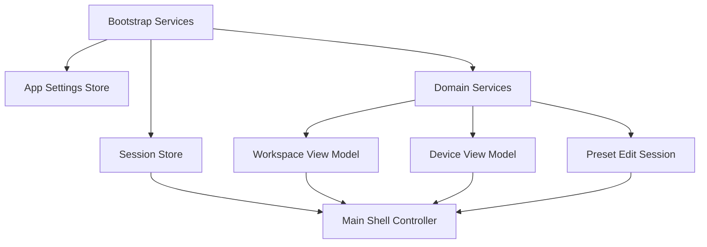

# GUI State Management

## Purpose

This document explains how GUI state is currently stored, mutated, synchronized, and persisted across OrcaSlicer's desktop UI, and what state model is recommended for Unity.

Primary evidence comes from `src/slic3r/GUI/GUI_App.hpp:L229-L330`, `src/slic3r/GUI/MainFrame.hpp:L361-L409`, `src/slic3r/GUI/Plater.hpp:L306-L410`, `src/slic3r/GUI/Plater.cpp:L4832-L4891`, `src/slic3r/GUI/Tab.hpp:L179-L190`, `src/slic3r/GUI/Tab.hpp:L255-L315`, `src/slic3r/GUI/Project.hpp:L63-L90`, `src/slic3r/GUI/Monitor.hpp:L173-L178`, and `src/slic3r/GUI/BackgroundSlicingProcess.hpp:L175-L327`.

## State Taxonomy

| State category | Typical examples | Current owner | Risk in current design | Unity recommendation |
| --- | --- | --- | --- | --- |
| Ephemeral view state | selected tab, hovered gizmo, popup visibility, tooltip text | `MainFrame`, `GLCanvas3D`, individual widgets | Easy to entangle with domain logic | Keep local to view/controller |
| Session state | current project, selected printer, current screen mode, preview options | `Plater`, `MainFrame`, `Monitor`, `ProjectPanel` | Often spread across page owners and globals | Store in scene/session view models |
| Persistent settings | theme, locale, app config, presets, recent projects | `GUI_App`, `Tab`, app config/preset subsystems | Mixed with live widget state | Store in serialized settings/preset services |
| Domain-backed state | model objects, print objects, device status, upload jobs, slicing steps | `Plater`, `BackgroundSlicingProcess`, device managers | UI reaches directly into domain objects | Wrap in service/domain layer and expose read models |

## Ownership And Mutation Patterns

### Global Application State

`GUI_App` keeps lifecycle flags, palette/font/locale state, service pointers, network flags, and background-thread ownership (`src/slic3r/GUI/GUI_App.hpp:L229-L330`). The codebase frequently accesses this state through `wxGetApp()`.

Current pattern: global singleton as both service locator and mutable state store.

Unity recommendation: preserve service lifetime, but stop using the root bootstrap as a mutable catch-all store.

### Main Window State

`MainFrame` owns screen references plus shell-local selection state such as `m_print_select`, `m_slice_select`, enable flags, and button/popup objects (`src/slic3r/GUI/MainFrame.hpp:L361-L409`).

Current pattern: view shell owns both navigation objects and action-selection state.

Unity recommendation: introduce a shell-level state model with route, action mode, and modal stack state.

### Workspace / Project State

`Plater` exposes project dirty/save behavior, model and print access, project/file loading, G-code loading, thumbnails, and update triggers (`src/slic3r/GUI/Plater.hpp:L306-L410`). Internally it keeps a large mutable implementation object with project metadata, dirty-state bookkeeping, warnings, timestamps, and workflow fields (`src/slic3r/GUI/Plater.cpp:L4832-L4891`).

Current pattern: one panel owns both core project domain state and a large amount of transient UI workflow state.

Unity recommendation: split into:

- domain state: project/model/plates/prints
- session state: selected plate/object/view mode
- UI state: overlays, notifications, modal intents

### Preset State

`Tab` keeps active preset references, page lists, dirty flags, non-system state, dependency links, and the update recursion guard `m_update_cnt` (`src/slic3r/GUI/Tab.hpp:L255-L315`).

Current pattern: preset state is part model cache, part view lifecycle, part mutation lock.

Unity recommendation: represent presets as immutable snapshots plus explicit edit sessions, then bind UI to the edit session.

### Screen-Local Bridge State

`ProjectPanel` is a good example of a mixed bridge-state owner. It keeps browser, auxiliary panel, URL/path roots, load guards, and JS sequence IDs (`src/slic3r/GUI/Project.hpp:L63-L90`). `Monitor` keeps a transient `MachineObject*` while real ownership sits below in the device layer (`src/slic3r/GUI/Monitor.hpp:L173-L178`).

Unity recommendation: browser/device bridges should expose typed state models rather than storing protocol/session details directly on views.

## Synchronization Points And Invalidation Patterns

### Explicit Update Triggers

The current GUI relies heavily on explicit update calls and custom events rather than declarative bindings. `Plater::update()` and related hooks fan changes across workspace state, preview invalidation, thumbnails, and background slicing state (`src/slic3r/GUI/Plater.hpp:L406-L410`).

### Background State Hand-Off

`BackgroundSlicingProcess` exposes a worker state machine (`STATE_INITIAL` through `STATE_EXITED`), print step state, and a single planned UI task channel for synchronous main-thread work (`src/slic3r/GUI/BackgroundSlicingProcess.hpp:L175-L327`).

This means several important GUI states are synchronized through:

1. worker state checks
2. queued wx events
3. synchronous UI tasks
4. dirty/invalidation flags

### Mutation Guard Patterns

Several subsystems prevent recursive or invalid UI updates with local counters and boolean guards, such as `GUI_App` initialization flags and `Tab::m_update_cnt` (`src/slic3r/GUI/GUI_App.hpp:L230-L235`, `src/slic3r/GUI/Tab.hpp:L311-L315`).

Unity recommendation: prefer explicit transactional update scopes or reducer-style state transitions over ad hoc recursion guards.

## Persistence And Settings Interactions

### App-Level Persistence

Theme, locale, recent projects, and app config values are coordinated from the app shell and main frame (`src/slic3r/GUI/GUI_App.hpp:L247-L276`, `src/slic3r/GUI/MainFrame.hpp:L257-L258`, `src/slic3r/GUI/MainFrame.hpp:L333-L336`).

### Project Persistence

`Plater` owns project dirty tracking and save/reset logic (`src/slic3r/GUI/Plater.hpp:L308-L315`, `src/slic3r/GUI/Plater.hpp:L327-L335`). This is a strong signal that project persistence is still too UI-owned.

### Preset Persistence

Preset tabs combine edit state, compatibility state, and persistence decisions. That makes it hard to reason about whether a mutation is local, persistent, or just pending user confirmation.

Unity recommendation: define separate stores for:

- persisted app settings
- persisted presets
- current workspace session
- transient modal/edit state

## Recommended Unity State Model

### Suggested Mapping

| Current state owner | Unity replacement |
| --- | --- |
| `GUI_App` mutable flags and globals | bootstrap services + app settings store |
| `MainFrame` route/action flags | shell state model |
| `Plater` mixed project/UI state | workspace domain service + workspace view model |
| `Tab` dirty/update/preset caches | preset edit-session model |
| `BackgroundSlicingProcess` worker state | slicing service state machine |
| browser/device bridge fields on views | typed adapter/service state |

## Unresolved Ambiguities

- The source shows many mutable fields but not one authoritative state diagram for project or preset editing, so some state boundaries still have to be chosen architecturally.
- Device and cloud state cross several managers not fully enumerated in this document; a dedicated device/session state map may be needed in implementation planning.
